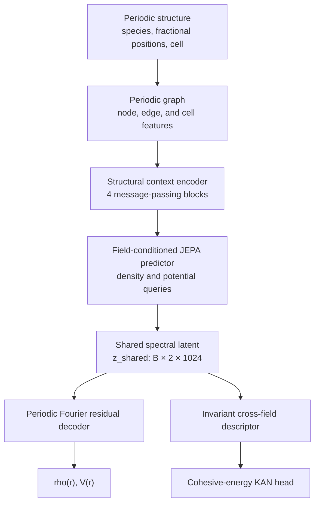
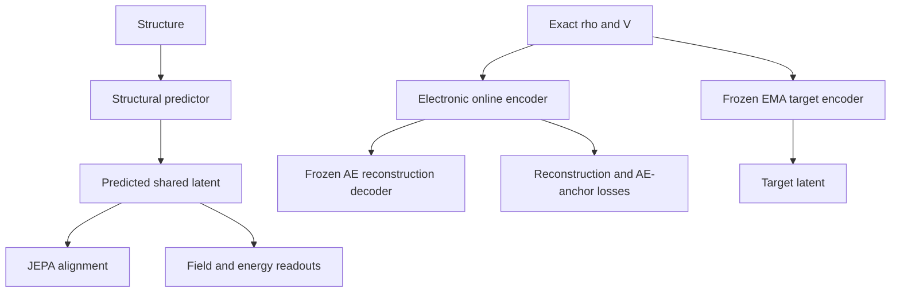
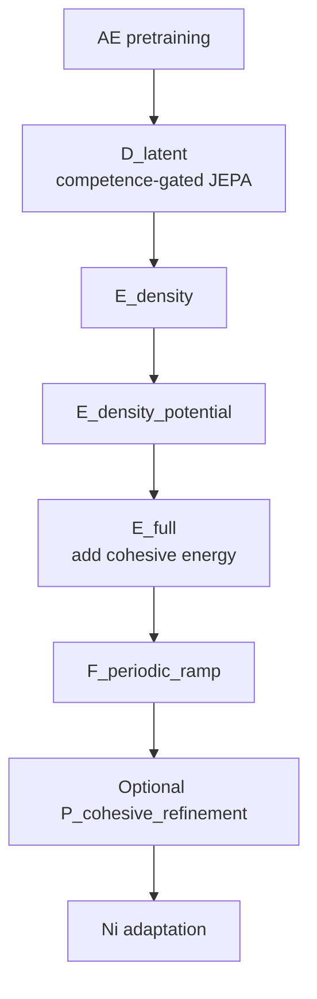

# Periodic JEPA for Al–Fe Pretraining and Ni Transfer

This repository/notebook implements a periodic, structure-to-electronic-field neural operator for crystalline systems. The current reference implementation is:

`Periodic_JEPA_AlFe_Ni_v31.ipynb`

The model is pretrained on Al and Fe, learns a shared Fourier representation of the electron density and electrostatic potential, predicts an experimentally anchored cohesive energy from that same electronic latent, and is subsequently adapted to Ni under explicit retention constraints.

The design has four central principles:

1. **Structure-only inference.** Density, potential, and energy targets are never accepted by the inference path.
2. **Periodic geometry and periodic fields.** The graph, Fourier representation, decoder, augmentation, and consistency losses respect periodic boundary conditions.
3. **One shared electronic latent.** Density, potential, and cohesive energy are coupled through the same predicted spectral representation.
4. **Gate-driven optimization.** New objectives and trainable modules are introduced progressively; validation competence, not elapsed time alone, controls important transitions.

> **Scope.** This README documents the behavior implemented in V31. It distinguishes implemented mechanisms from quality goals and does not treat a failed scientific gate as a successful training run.

## Contents

- [1. End-to-end architecture](#1-end-to-end-architecture)
- [2. Data and physical-unit contract](#2-data-and-physical-unit-contract)
- [3. Periodic structural graph](#3-periodic-structural-graph)
- [4. Message passing and structural encoder](#4-message-passing-and-structural-encoder)
- [5. KAN blocks](#5-kan-blocks)
- [6. Periodic field autoencoder](#6-periodic-field-autoencoder)
- [7. Online encoder and EMA target encoder](#7-online-encoder-and-ema-target-encoder)
- [8. Structure-to-latent JEPA predictor](#8-structure-to-latent-jepa-predictor)
- [9. Shared latent and readouts](#9-shared-latent-and-readouts)
- [10. Loss functions](#10-loss-functions)
- [11. Curriculum, ramps, and gates](#11-curriculum-ramps-and-gates)
- [12. Physical-difficulty curriculum](#12-physical-difficulty-curriculum)
- [13. Ni transfer and retention](#13-ni-transfer-and-retention)
- [14. Optimization, EMA, and checkpoints](#14-optimization-ema-and-checkpoints)
- [15. Evaluation and scientific acceptance](#15-evaluation-and-scientific-acceptance)
- [16. Execution](#16-execution)
- [17. Outputs and audit trail](#17-outputs-and-audit-trail)
- [18. Implementation notes and limitations](#18-implementation-notes-and-limitations)

## 1. End-to-end architecture

At inference time, the model receives only a periodic structure: atomic identities, fractional coordinates, and the lattice. It returns normalized electron density, relative electrostatic potential, and normalized cohesive energy.



During training, exact fields provide a second, electronic route. This route defines the autoencoder representation and the EMA target used by JEPA.



The inference method `forward_operator` rejects any batch containing target keys. The training-only method `forward_train` is the only route that consumes `field_input`.

### Default tensor contract

| Quantity | Shape | Meaning |
|---|---:|---|
| Canonical field grid | `(48, 32, 32)` | Grid axes are stored as `(z, y, x)` |
| Field input | `[B, 2, 48, 32, 32]` | Channels are `log(rho_scaled)` and `V_scaled` |
| Retained modes | `512` complex modes per field | Low-frequency Hermitian representatives |
| Field latent | `[B, 2, 1024]` | Real/imaginary pairs for 512 complex modes |
| Structural hidden width | `128` | Node, graph, field-token, and head width |
| Field tokens | `2` | One density token and one potential token |

## 2. Data and physical-unit contract

The notebook treats units as part of the training contract and stores them in checkpoints and run manifests.

| Quantity | Physical unit | Internal representation |
|---|---|---|
| SIESTA total energy | eV/cell | Read from the converged calculation index/output |
| Cohesive energy | eV/atom | Globally robust-normalized for optimization |
| Reported energy errors | meV/atom or eV/atom | Converted from the same global scale |
| Electron density | electron/Bohr³ | Charge-normalized dimensionless field in the network |
| Electrostatic potential | Ry | Gauge-centered and divided by the train-only RMS scale |
| Structural cell | Å | Graph geometry |
| NetCDF cell | Bohr | Converted and cross-checked against `STRUCT_OUT` |

The conversion constants are

$$
1\ \mathrm{Bohr}=0.529177210903\ \mathrm{\mathring A},
\qquad
1\ \mathrm{Ry}=13.605693122994\ \mathrm{eV},
$$

and

$$
1\ \mathrm{eV/atom}=96.48533212331002\ \mathrm{kJ/mol}.
$$

### 2.1 Canonical density

Native density and potential grids are periodically resampled by Fourier interpolation. Small negative density values introduced by interpolation are clipped, after which the density is normalized to the expected valence-electron count:

$$
\int_{\Omega}\rho(\mathbf r)\,d\mathbf r=N_e.
$$

The dimensionless density supplied to the model is

$$
\rho_{\mathrm{scaled}}(\mathbf r)
=\rho(\mathbf r)\frac{\Omega}{N_e},
$$

so its cell average is exactly one. The autoencoder input uses

$$
x_\rho(\mathbf r)=\log\!\left(\max(\rho_{\mathrm{scaled}}(\mathbf r),\epsilon_\rho)\right),
$$

with `density_floor = 1e-8`.

To recover physical density from an inference output,

$$
\rho(\mathbf r)=\rho_{\mathrm{scaled}}(\mathbf r)\frac{N_e}{\Omega}
\quad [\mathrm{electron/Bohr^3}].
$$

### 2.2 Potential gauge and scale

The additive gauge is removed before training:

$$
V_{\mathrm{rel}}(\mathbf r)=V(\mathbf r)-\langle V\rangle_{\Omega}.
$$

The network target is

$$
V_{\mathrm{scaled}}=\frac{V_{\mathrm{rel}}}{s_V},
$$

where $s_V$ is an RMS scale fitted only on the Al/Fe training split and lower-bounded by `0.05 Ry`. Physical relative potential is recovered as $V_{\mathrm{rel}}=s_VV_{\mathrm{scaled}}$.

### 2.3 Experimentally anchored cohesive energy

The supervised energy is not the raw total energy and is not a free-atom DFT subtraction. For configuration $i$ of element $e$,

$$
E_{\mathrm{coh}}^{(i)}
=H_{\mathrm{atomization},e}^{298.15\,\mathrm K}
+\varepsilon_{\mathrm{bulk\ ref},e}^{\mathrm{train}}
-\frac{E_{\mathrm{total}}^{(i)}}{N_i}.
$$

The embedded thermochemical anchors are:

| Element | Anchor (kJ/mol) |
|---|---:|
| Al | 329.70 |
| Fe | 415.47 |
| Ni | 430.10 |

For each element, the bulk reference is selected automatically and deterministically from an eligible training pool using supported low-energy family tails. Validation and holdout records are not used to choose it. Consequently:

- absolute cohesive-energy zero is thermochemically anchored;
- relative differences between configurations still come from the SIESTA total energies;
- Ni model weights are zero-shot before adaptation, but the Ni target zero is calibrated from `ni_adapt_train`.

A single global robust normalization is fitted on Al/Fe training cohesive energies:

$$
\widetilde E_{\mathrm{coh}}
=\frac{E_{\mathrm{coh}}-m_E}{s_E},
\qquad
m_E=\operatorname{median}(E_{\mathrm{coh}}),
\qquad
s_E=\max(1.4826\,\mathrm{MAD},10^{-3}).
$$

The same frozen $m_E$ and $s_E$ are used for Ni.

## 3. Periodic structural graph

### 3.1 Node features

Each atom receives invariant elemental features

$$
\left[Z/30,\ M/60,\ n_{\mathrm{val}}/20,\ g/18,\ p/7\right],
$$

where $Z$ is atomic number, $M$ is atomic mass, $n_{\mathrm{val}}$ is the configured valence, and $g,p$ are periodic-table group and period.

A local radial environment is added by summing 24 Gaussian radial basis functions over periodic neighbors. Fractional coordinates are also represented through four-frequency sine/cosine encodings for operations that require periodic positional information.

The Ni atomic correction is a zero-initialized trainable residual. It therefore leaves the pretrained Al/Fe representation unchanged before Ni adaptation.

### 3.2 Periodic edges

For atoms $i$ and $j$ and lattice image $\mathbf n\in\mathbb Z^3$,

$$
\Delta\mathbf s_{ij\mathbf n}=\mathbf s_j+\mathbf n-\mathbf s_i,
\qquad
\Delta\mathbf r_{ij\mathbf n}=\Delta\mathbf s_{ij\mathbf n}\,\mathbf A,
$$

where $\mathbf s$ are fractional coordinates and $\mathbf A$ is the cell matrix. V31 enumerates image candidates inside a fractional extent of `1.0`, keeps nonzero distances, includes nonzero periodic images of the same atom, and fails rather than silently truncating a graph that exceeds the configured edge budget.

Each edge contains:

- distance divided by a cell-dependent scale;
- `log1p(distance)` in Å;
- 24 Gaussian RBF values multiplied by a fractional-cell envelope;
- a Cartesian unit direction for the field-conditioned predictor;
- the integer image shift for periodic bookkeeping.

### 3.3 Cell features

The graph-level cell vector contains

$$
\left[
\frac{a}{5},\frac{b}{5},\frac{c}{5},
\cos\alpha,\cos\beta,\cos\gamma,
\log\left(\frac{\Omega}{N}\right),
\frac{N}{8}
\right].
$$

This gives the readout explicit access to lattice lengths, angles, volume per atom, and atom count.

## 4. Message passing and structural encoder

The production backbone is `pyg_gnn_kan` with four periodic message-passing blocks. Let $h_i$ be the node state, $e_{ij}$ the edge attributes, and $g_b$ the deterministic mean-pooled context of graph $b$. A message is

$$
m_{ij}=F_{\mathrm{msg}}\!\left(
[\,\operatorname{LN}(h_i),\ \operatorname{LN}(h_j)-\operatorname{LN}(h_i),\ g_b,\ e_{ij}\,]
\right).
$$

Incoming messages are aggregated with a deterministic segmented mean,

$$
\bar m_i=\operatorname{mean}_{j\rightarrow i}m_{ij},
$$

and the residual update is

$$
h_i' = h_i+\sigma(\gamma)
F_{\mathrm{upd}}\!\left(
[\,\operatorname{LN}(h_i),\bar m_i,g_b\,]
\right).
$$

The scalar gate $\gamma$ is learned and initialized conservatively. After four blocks, node states are normalized, mean-pooled, concatenated with the cell vector, and mapped to a graph-level field context.

The code retains MLP and Transformer definitions for comparison, but the V31 production configuration explicitly requires `pyg_gnn_kan`.

## 5. KAN blocks

KAN layers are used at the configured placements:

- message network;
- node update network;
- field predictor;
- periodic residual decoder;
- cohesive-energy head.

The default basis is Chebyshev with degree 4 and coefficient rank 8. For transformed input $z=\tanh(x)$,

$$
T_0(z)=1,\qquad T_1(z)=z,\qquad
T_d(z)=2zT_{d-1}(z)-T_{d-2}(z).
$$

V31 also implements Legendre and normalized probabilists' Hermite recurrences. Hermite inputs use running mean/variance normalization and clipping to $[-3,3]$.

The dense coefficient tensor is low-rank factorized:

$$
c_{oid}\approx\sum_{r=1}^{R}U_{or}B_{rid}.
$$

The layer output is

$$
y=W\,\operatorname{SiLU}(x)+
\left(\sum_{i,d}\phi_d(z_i)B_{rid}\right)U_{or}.
$$

Only degrees $1,\ldots,D$ enter the basis branch; the constant term is not duplicated. The KAN regularizer penalizes high-order coefficients more strongly:

$$
\mathcal L_{\mathrm{KAN}}
=\operatorname{mean}_{o,i,d}\left(d^2c_{oid}^2\right).
$$

## 6. Periodic field autoencoder

The autoencoder establishes the electronic coordinate system before JEPA begins.

### 6.1 Spectral encoder

The two-channel input is

$$
X=[\log\rho_{\mathrm{scaled}},\ V_{\mathrm{scaled}}].
$$

A three-dimensional orthonormal real FFT is applied. The encoder retains 512 low-frequency Hermitian representatives, including the $k_x=0$ plane while omitting redundant partners and Nyquist planes. Each complex coefficient is stored as a real/imaginary pair.

For field $f$ and mode $k$,

$$
z^{\mathrm{raw}}_{fk}
=\frac{[\operatorname{Re}\hat X_{fk},\operatorname{Im}\hat X_{fk}]}{s_{fk}},
$$

where $s_{fk}$ is a phase-compatible pairwise RMS fitted only from the Al/Fe training split with equal element contribution.

A small phase-equivariant residual lift defines the learned latent:

$$
z_{f}=z^{\mathrm{raw}}_{f}+0.05\,R_{\mathrm{phase}}(z^{\mathrm{raw}})_f.
$$

The DC imaginary component is structurally zero and is excluded from JEPA alignment and invariant energy features.

### 6.2 Reconstruction decoder

Density and potential use independent fieldwise linear maps initialized to identity. Coefficients are returned to physical spectral scale, the missing Hermitian partners on the $k_x=0$ plane are restored, and an inverse rFFT produces periodic fields.

The output constraints are:

$$
\rho_{\mathrm{pred}}=\frac{\exp(8\tanh(u_\rho/8))}
{\left\langle\exp(8\tanh(u_\rho/8))\right\rangle},
$$

and

$$
V_{\mathrm{pred}}=u_V-\langle u_V\rangle.
$$

Thus density is positive with unit mean and potential has zero gauge.

### 6.3 AE branches and loss

The AE phase trains:

- `field_online_encoder`;
- `field_reconstruction_decoder`;
- `cohesive_head` from the same AE latent.

The AE objective is

$$
\mathcal L_{\mathrm{AE}}
=\mathcal L_\rho+\mathcal L_V
+10^{-3}\mathcal L_{\mathrm{anchor}}
+\lambda_{E,\mathrm{AE}}(p)\mathcal L_E,
$$

with

$$
\mathcal L_{\mathrm{anchor}}
=\operatorname{SmoothL1}(z,z^{\mathrm{raw}}).
$$

The final AE cohesive weight is `0.15`; it ramps from zero between normalized progress `0.10` and `0.30`.

After an AE checkpoint passes its gates, exact independent copies initialize the predictor field lift, the electronic online encoder, and the target encoder. The original AE encoder and reconstruction decoder are then permanently frozen for JEPA and Ni transfer.

## 7. Online encoder and EMA target encoder

The electronic branch contains three conceptually distinct encoder instances:

| Module | Role | Updated by |
|---|---|---|
| `field_online_encoder` | Selected AE reference | Frozen after AE |
| `electronic_online_encoder` | Slowly adaptable electronic student | Gradient descent in D/E/F |
| `field_target_encoder` | JEPA target/teacher | EMA of the electronic online encoder |

The target is always in evaluation mode, has no gradients, and is excluded from every optimizer.

For target parameter $\theta_t$ and electronic-online parameter $\theta_o$,

$$
\theta_t\leftarrow\tau\theta_t+(1-\tau)\theta_o.
$$

The momentum coefficient follows a global Al/Fe cosine schedule:

$$
\tau(p)=\tau_{\mathrm{end}}
-(\tau_{\mathrm{end}}-\tau_{\mathrm{start}})
\frac{1+\cos(\pi p)}{2},
$$

with $\tau_{\mathrm{start}}=0.996$ and $\tau_{\mathrm{end}}=0.999$.

Important details:

- the EMA clock does not restart at every D/E/F stage;
- the target can remain frozen until the D-low-band competence gate is satisfied;
- EMA is updated only after a successful optimizer update;
- skipped AMP steps do not advance EMA or the scheduler;
- EMA is completely frozen during all Ni stages.

The electronic online encoder is regularized through field reconstruction with the frozen AE decoder and an anchor to the original frozen AE representation. This permits limited target evolution without discarding the pretrained electronic coordinate system.

## 8. Structure-to-latent JEPA predictor

The predictor converts structural node and graph contexts into the same spectral coordinates used by the electronic target encoder.

### 8.1 Field conditioning

Separate learned queries are used for density and potential. For field $f$,

$$
h_i^{(f,0)}=F_{\mathrm{in}}([h_i,q_f,g_b]).
$$

A directional periodic message-passing block refines each field state. Mean-pooled density and potential tokens then interact through multi-head attention. The token update is broadcast back to the corresponding nodes.

### 8.2 Mode-conditioned complex amplitudes

For every retained Fourier mode, the predictor combines:

- the field-conditioned node state;
- a learned mode embedding;
- normalized integer wavevector direction;
- logarithmic Cartesian wavevector magnitude derived from the reciprocal cell.

A KAN block and a linear complex readout produce nodewise complex amplitudes. Analytic atomic phases impose the correct periodic translation law:

$$
\phi_{ik}=\exp(-2\pi i\,\mathbf k\cdot\mathbf s_i).
$$

After phase rotation and deterministic graph averaging, the predictor obtains raw complex Fourier coordinates. Pairwise scaling preserves phase, and the same residual lift learned from the AE maps them into `z_shared`.

For a fractional translation $\Delta\mathbf s$,

$$
\hat f_k'=exp(-2\pi i\,\mathbf k\cdot\Delta\mathbf s)\hat f_k.
$$

The raw spectral output follows this law analytically; the learned lift and residual decoder are additionally checked by translation-consistency tests.

## 9. Shared latent and readouts

### 9.1 Shared electronic latent

`z_shared` has two field channels, but it is a single coupled representation: the field decoder consumes both field latents, and the energy descriptor combines density, potential, and their cross-spectrum.

For physical-scale complex pairs $r_k$ and $v_k$, define

$$
a_{\rho,k}=|r_k|,\qquad a_{V,k}=|v_k|,
$$

$$
c_k^{\mathrm{Re}}
=\frac{\operatorname{Re}(r_kv_k^*)}{1+a_{\rho,k}a_{V,k}},
\qquad
c_k^{\mathrm{Im}}
=\frac{\operatorname{Im}(r_kv_k^*)}{1+a_{\rho,k}a_{V,k}}.
$$

The translation-invariant energy descriptor is

$$
d(z)=\operatorname{concat}_k
\left[
\log(1+a_{\rho,k}),
\log(1+a_{V,k}),
c_k^{\mathrm{Re}},
c_k^{\mathrm{Im}}
\right],
$$

with the DC mode masked. Because a translation rotates both field coefficients by the same phase, magnitudes and the cross-spectrum remain invariant.

### 9.2 Prediction decoder

The inference decoder is separate from the AE reconstruction decoder. For field $f$,

$$
z_{\mathrm{dec},f}
=B_f(z_f)+\sigma(\gamma_f)H_f(P_f(z_f)),
$$

where $B_f$ is initialized as an identity map and the residual branch uses KAN blocks. Density and potential have independent parameters. A bounded learned scalar adjusts potential amplitude before the final zero-gauge constraint.

### 9.3 Cohesive-energy readout

The energy head is a KAN readout of $d(z)$ only; it does not receive the structural context directly. Its normalized prediction is

$$
\widetilde E_{\mathrm{pred}}
=\widetilde E_{\mathrm{anchor},e}+r_\theta(d(z)).
$$

For Ni only, the residual passes through an identity-initialized affine calibration:

$$
r_{\mathrm{Ni}}'=\exp(a)r_{\mathrm{Ni}}+b,
$$

with bounded log-scale $a$. Ni also has a phase-preserving per-field spectral gain. No additive complex bias is allowed because it would violate translation equivariance.

## 10. Loss functions

The stage objective is

$$
\mathcal L_{\mathrm{stage}}(p)
=\sum_t\lambda_t(p)\,\mathcal L_t,
$$

where the active terms and coefficients depend on the current stage, ramps, competence state, and optional gradient-balance factors.

### 10.1 Density loss

For each sample, V31 combines log-density Smooth L1, relative $L_2$, Cartesian-gradient error, spectral error, and log-RMS amplitude error:

$$
\begin{aligned}
\mathcal L_\rho={}&
0.33\,\mathcal L_{\log\rho}
+0.50\,\mathcal L_{\rho,\mathrm{rel}}
+0.12\,\mathcal L_{\rho,\nabla}
+0.05\,\mathcal L_{\rho,\mathrm{spec}}\\
&+0.05\,\mathcal L_{\rho,\log\mathrm{amp}}.
\end{aligned}
$$

The Cartesian gradient uses the inverse cell and central periodic differences, so anisotropic and nonorthogonal cells are handled explicitly. The spectral relative error upweights high-frequency residuals by up to a factor controlled by `spectral_high_frequency_boost = 4.0`.

For Al/Fe batches, element reduction is

$$
\mathcal R(\ell)=0.5\,\operatorname{mean}_e\bar\ell_e
+0.5\,\max_e\bar\ell_e,
$$

which prevents the easier element from dominating.

### 10.2 Potential loss

Both predicted and target potentials are gauge-centered. With target RMS $s$,

$$
\begin{aligned}
\mathcal L_V={}&
0.10\,\mathcal L_{V,\mathrm{shape}}
+0.20\,\mathcal L_{V,\mathrm{rel}}
+0.30\,\mathcal L_{V,\mathrm{amp}}\\
&+0.10\,\mathcal L_{V,\cos}
+0.15\,\mathcal L_{V,\nabla}
+0.15\,\mathcal L_{V,\mathrm{spec}}
+0.15\,\mathcal L_{V,\log\mathrm{amp}}.
\end{aligned}
$$

The individual terms are:

- Smooth L1 between $V_{\mathrm{pred}}/s$ and $V/s$;
- relative field $L_2$;
- RMS-amplitude Smooth L1;
- $1-\cos(V_{\mathrm{pred}},V)$;
- cell-aware Cartesian-gradient error;
- weighted relative rFFT error;
- absolute difference between log RMS amplitudes.

### 10.3 JEPA spectral alignment

The non-DC latent is split into three contiguous real-coordinate bands:

| Band | Coordinates | Final weight |
|---|---:|---:|
| Low | `[2, 130)` | 0.45 |
| Middle | `[130, 514)` | 0.35 |
| High | `[514, 1024)` | 0.20 |

For each field and band $b$,

$$
\mathcal L_{\mathrm{JEPA},b}
=\operatorname{SmoothL1}(z_b^{\mathrm{pred}},z_b^{\mathrm{target}})
+0.25\operatorname{SmoothL1}
(\operatorname{LN}z_b^{\mathrm{pred}},\operatorname{LN}z_b^{\mathrm{target}}).
$$

A separate cosine term is

$$
\mathcal L_{\cos,b}
=1-\cos(z_b^{\mathrm{pred}},z_b^{\mathrm{target}}).
$$

Density and potential contribute equally. Additional losses match target standard deviations and covariances across records, and match the RMS scale of each band. Targets are always stop-gradient.

### 10.4 Cohesive-energy loss

The main point loss is Smooth L1 in normalized coordinates with a physical transition scale of `0.025 eV/atom`:

$$
\mathcal L_{E,i}
=\operatorname{Huber}_{\beta/s_E}
(\widetilde E_i^{\mathrm{pred}}-\widetilde E_i).
$$

The lower cohesive-energy tail corresponds to weak binding. Training weights are:

- ordinary records: `1.0`;
- lower 10% per element: `1.5`;
- lower 1% per element: `2.0`;
- upper tail: additional factor up to `1.25`;
- combined per-sample cap: `3.0`.

The configured asymmetric overbinding penalty is currently neutral (`1.0`). A bounded FIFO with 128 detached residuals per element adds a differentiable squared mean-bias penalty after at least 64 records:

$$
\mathcal L_{\mathrm{bias},e}=0.10\,\bar r_e^2.
$$

The slope penalty is implemented but disabled by default (`energy_slope_weight = 0.0`); slope remains an evaluation and gate diagnostic.

### 10.5 Electronic online regularization

During D/E/F,

$$
\mathcal L_{\mathrm{electronic}}
=\mathcal L_\rho^{\mathrm{recon}}
+\mathcal L_V^{\mathrm{recon}}
+0.10\operatorname{SmoothL1}
(z_{\mathrm{electronic}},z_{\mathrm{AE\ frozen}}).
$$

The decoder is frozen, but gradients pass through it to the electronic online encoder.

### 10.6 Translation consistency

For a discrete periodic translation $T_\Delta$,

$$
\begin{aligned}
\mathcal L_{\mathrm{trans}}={}&
\operatorname{RelErr}(\rho(T_\Delta x),T_\Delta\rho(x))\\
&+\operatorname{RelErr}(V(T_\Delta x),T_\Delta V(x))
+\operatorname{SmoothL1}(E(T_\Delta x),E(x)).
\end{aligned}
$$

This term is sampled with probability `0.50` when active. Independent translation augmentation of supervised batches is configured with probability `1.00`.

### 10.7 Retention distillation

During Ni adaptation, a frozen pre-Ni teacher supervises a separate Al/Fe replay stream:

$$
\mathcal L_{\mathrm{ret}}
=0.75\mathcal L_{\log\rho}
+2.50\mathcal L_V
+0.50\mathcal L_E
+0.25\mathcal L_z.
$$

Fe replay receives an additional multiplier of `1.50`. The retention coefficient is ramped rather than switched on abruptly.

## 11. Curriculum, ramps, and gates

### 11.1 Generic cosine ramp

For a contribution with final coefficient $\lambda_{\mathrm{final}}$, the effective weight is

$$
\lambda(p)=\lambda_{\mathrm{final}}
\frac{1-\cos(\pi\bar p)}{2},
\qquad
\bar p=\operatorname{clip}\left(\frac{p}{f_{\mathrm{ramp}}},0,1\right).
$$

The default objective-ramp fraction is $f_{\mathrm{ramp}}=0.70`. This is used when introducing density, potential, cohesive energy, and periodic consistency. Retention uses its own fraction `0.50`.

A windowed version releases gradients or parameter groups between start $a$ and end $b$:

$$
w(p;a,b)=\frac{1-\cos\left(\pi\operatorname{clip}\frac{p-a}{b-a}\right)}{2}.
$$

### 11.2 Al/Fe stages



| Stage | New objective or action | Main trainable modules |
|---|---|---|
| `autoencoder` | Reconstruct fields; introduce AE energy between 10–30% | AE encoder, AE decoder, cohesive head |
| `D_latent` | Align structural latent to EMA electronic latent | structural encoder, predictor, electronic online encoder |
| `E_density` | Ramp density supervision | structural encoder, predictor, prediction decoder, electronic online encoder |
| `E_density_potential` | Ramp potential supervision | same as E-density |
| `E_full` | Ramp cohesive supervision; release energy gradients into shared latent | previous modules plus cohesive head |
| `F_periodic_ramp` | Ramp periodic translation consistency | full source-domain training set of modules |
| `P_cohesive_refinement` | Optional representation-frozen energy calibration | cohesive head only |

`D_latent` has a special competence-driven spectral curriculum:

1. low band starts active;
2. middle band unlocks after the minimum validation low-band cosine reaches `0.70` for the required hysteresis;
3. high band unlocks after middle-band cosine reaches `0.60`;
4. high-band readiness requires cosine `0.50`;
5. each newly unlocked band enters through a local cosine ramp of length `0.15` in normalized stage progress;
6. the D objective crossfades to the final JEPA weights only after both fields are high-band ready.

Final full-latent D gates require minimum cosine `0.80` for density and `0.70` for potential.

In `E_full`, the energy head begins learning immediately, but the gradient reaching the shared latent is released only from progress `0.65` to `0.90`:

$$
z_E=\operatorname{stopgrad}(z)
+w(p;0.65,0.90)\left(z-\operatorname{stopgrad}(z)\right).
$$

This protects the field representation while the cohesive readout first learns its mapping.

### 11.3 Readiness and early stopping

A checkpoint is eligible only when all required conditions are true, including:

- warm-up completion;
- objective-ramp completion;
- adequate sample coverage and hard-sample updates;
- finite validation metrics;
- stage-specific physical competence gates;
- required consecutive passing validations (`patience = 2` outside smoke tests).

Readiness is not considered before 40% of the scheduled stage unless a stricter stage-specific condition applies. Early stopping is therefore prevented from terminating a stage before its new objective has reached the intended regime.

### 11.4 Stage competence gates

| Stage | Principal implemented gate |
|---|---|
| AE | Al/Fe coverage ≥ 0.95; $\rho$ relative L2 ≤ 0.60; $V$ relative L2 ≤ 0.80 |
| D | all spectral unlocks complete; full cosine thresholds satisfied |
| E-density | $\rho$ relative L2 ≤ 0.55 |
| E-density-potential | $\rho$ ≤ 0.45; $V$ ≤ 0.60; potential cosine ≥ 0.75; RMS ratio in `[0.70, 1.30]` |
| E-full | both field relative errors ≤ 0.45; potential shape/amplitude gates pass |
| F | E-full field gates plus periodic consistency ≤ 0.15 |
| P/Ni entry | source-domain field and energy gates pass |

Absolute cohesive-energy gates are evaluated per element:

| Metric | Limit |
|---|---:|
| MAE | 0.10 eV/atom |
| Absolute bias | 0.02 eV/atom |
| Error p95 | 0.30 eV/atom |
| Maximum absolute error | 0.60 eV/atom |
| Supported fitted slope | within 0.25 of 1.0 |

These are scientific acceptance gates, not loss coefficients.

## 12. Physical-difficulty curriculum

The `control` and `physical` modes use exactly the same eligible IDs and the same number of draws. The physical curriculum changes **ordering**, not dataset size.

### 12.1 Difficulty descriptors

The manifest records, where available:

- energy relative to the minimum within element/family;
- volume per atom and volumetric deformation;
- cell deformation, shear, and anisotropy;
- fractional-displacement RMS and maximum within known structural groups;
- nearest-neighbor distance and coordination;
- structural family and provenance group.

For each element, each available continuous descriptor is converted to a percentile rank. The currently implemented scalar difficulty is the unweighted mean of these percentile ranks:

$$
d_i=\frac{1}{K_i}\sum_{k=1}^{K_i}\operatorname{rankpct}_e(x_{ik}).
$$

The config field `physical_difficulty_weights = (0.35, 0.25, 0.20, 0.20)` is validated but is not currently applied by `structural_descriptor_frame`; the executed implementation uses the rank mean above.

### 12.2 Sampling behavior

Every allowed ID is visited in every epoch. In physical mode, selected stages use a weighted permutation without replacement. At global curriculum progress $p_g$,

$$
q=4(1-p_g),\qquad w_i=\exp(-q d_i).
$$

Lower-difficulty records therefore tend to occur earlier when $p_g$ is small. As training progresses, $q\rightarrow0$ and ordering approaches uniform. The ordering intervention is active in:

- `autoencoder`;
- `D_latent`;
- `G_adapter_warmup`.

Other stages use the full distribution with uniform priority. Al and Fe remain balanced within pretraining batches. The top 20% difficulty subset must receive at least one effective optimizer update before the hard-exposure gate passes.

This design avoids the previous failure mode in which difficult configurations could receive too little exposure. It is an easy-to-difficult ordering curriculum, not a progressive 10%→100% data-release schedule.

## 13. Ni transfer and retention

### 13.1 Leak-resistant Ni split

Known trajectories/base structures and exact geometry duplicates are kept within the same split. The Ni adaptation set is capped at 10% of the eligible in-distribution pool. Validation and holdout sets remain disjoint, and family-OOD records are kept separate where configured.

### 13.2 Representative 10% selection

The 10% Ni subset is not chosen by a simple random sample. Selection combines marginal quota coverage and group-aware farthest-point coverage over available descriptors, including:

- family;
- physical difficulty;
- relative energy;
- volume and cell deformation;
- shear and anisotropy;
- cell ratios and angles;
- displacement descriptors when complete;
- nearest distance and coordination;
- SCF iterations when complete.

Descriptors are standardized only on the eligible Ni pool, clipped to limit outlier influence, and audited in `ni_selection_manifest.json`. A random sample with the same size is recorded only as a baseline; it is not trained.

### 13.3 Ni stages

| Stage | Purpose | Trainable modules |
|---|---|---|
| `G_cohesive_calibration` | Fit Ni energy scale/offset without moving shared weights | Ni energy calibration only |
| `G_adapter_warmup` | Learn Ni-specific residual corrections | Ni embedding, field adapter, spectral gain, energy calibration |
| `G_joint_finetune` | Controlled shared adaptation | Ni modules, cohesive head, then predictor, decoder, last structural block |
| `G_retention_repair` | Conditional Al/Fe repair if retention constraints fail | cohesive head, predictor, prediction decoder |

The maximum-freezing configuration is the adapter warm-up. Joint fine-tuning then releases shared modules progressively:

| Module | Release begins | Fully released |
|---|---:|---:|
| Predictor | 0.15 | 0.35 |
| Prediction decoder | 0.35 | 0.60 |
| Last structural message-passing block | 0.65 | 0.85 |

Each group has its own release-local cosine learning-rate clock. Earlier pretrained structural blocks remain frozen. The AE and both electronic reference branches are frozen throughout Ni, and the EMA state is left untouched.

### 13.4 Separate retention stream and model selection

Al/Fe examples used for retention are supplied through a separate replay loader; they are not mixed into the Ni optimization dataset. Candidate selection uses only:

- Ni validation performance;
- Al/Fe validation retention;
- field constraints and absolute energy gates.

Holdout results never participate in checkpoint selection. A Pareto archive tracks Ni quality versus Al/Fe retention excess. If adaptation cannot meet strict constraints, the pre-Ni baseline remains an eligible final candidate; such a fallback is reported as `adaptation_accepted = false` and must not be described as successful fine-tuning.

## 14. Optimization, EMA, and checkpoints

### 14.1 AdamW state across stages

Model weights always continue from the selected previous checkpoint. Compatible AdamW moments are transferred by parameter name for parameters that remain trainable. Newly activated parameters receive fresh optimizer state; parameters no longer present in the optimizer are reported as removed.

The optimizer is recreated for each stage because its parameter groups change, but this does **not** mean that all Adam memory is reset.

### 14.2 Stage-local scheduler

The learning-rate scheduler intentionally restarts at each new stage while Adam moments are preserved. Each stage receives:

1. a 10% linear warm-up;
2. cosine decay over the remaining updates;
3. a final learning-rate floor of 10% of the stage peak.

The update budget is computed in optimizer updates rather than raw minibatches and accounts for gradient accumulation. `DEVELOPMENT` and `QUICK_TRAIN` use accumulation 4; the other profiles use accumulation 2.

### 14.3 Gradient clipping and mixed precision

Gradients are unscaled before clipping. Each parameter group is clipped to

$$
c_g=\min\left(2.0,\ 0.10\sqrt{N_g}\right),
$$

where $N_g$ is the group parameter count. Pre/post norms, clipping limits, and nonfinite events are logged. AMP-skipped optimizer updates do not advance the scheduler or EMA.

### 14.4 Gradient-conflict audit and adaptive balance

The notebook periodically computes per-objective gradients on a bounded subset of shared parameters. Pairwise cosine similarity identifies conflicts. Every 10 optimizer updates, a GradNorm-like rule moves active objective factors toward equal geometric-mean gradient norm:

$$
f_t^*=\operatorname{clip}
\left(\frac{\exp(\operatorname{mean}_j\log\|g_j\|)}{\|g_t\|},
0.25,4.0\right).
$$

If an objective has cosine below `-0.20` with another objective, its desired factor is multiplied by `0.65`. Factors are smoothed with EMA `0.90` and affect future loss coefficients. This is an auditable coefficient adjustment, not PCGrad and not an unlogged gradient projection.

### 14.5 Checkpoint contract

Before any in-memory restore, the notebook validates architecture and training compatibility. Checkpoints include, as applicable:

- architecture, graph, training-protocol, curriculum, and schema versions;
- configuration/training contract;
- model state and exact module shapes;
- named optimizer state and stage scheduler state;
- gradient scaler and random-number-generator states;
- normalization and unit contracts with hashes;
- split, data-curriculum, and Ni-selection manifest hashes;
- EMA phase state and target-update count;
- competence, exposure, gradient-balance, and early-stopping state;
- trainable/frozen module audit.

Writes are atomic. A changed configuration must use a new `PERIODIC_JEPA_RUN_TAG`; incompatible checkpoints are rejected instead of partially loading into the model.

## 15. Evaluation and scientific acceptance

Evaluation is reported per element and split. It includes:

- density relative L2, cosine similarity, gradients, and spectra;
- potential relative L2, shape cosine, RMS-amplitude ratio, gradients, and spectra;
- cohesive-energy MAE, RMSE, signed bias, median absolute error, p95, maximum error, and fitted slope when supported;
- weak- and extreme-tail errors;
- latent variance, effective rank, active rank, condition number, dominant fraction, and near-zero-variance fraction;
- periodic translation consistency;
- retention degradation relative to the frozen pre-Ni baseline;
- bootstrap uncertainty and inference timing where enabled.

Latent collapse gates require finite diagnostics, variance in range, effective rank at least 3, active rank at least 4, active condition number at most $10^6$, near-zero fraction at most 0.95, and dominant covariance fraction at most 0.95.

Final Ni quality goals include density and potential relative L2 of `0.10`, potential cosine `0.95`, high-band potential latent cosine `0.90`, and absolute cohesive-energy bias `0.02 eV/atom`. These are goals and audits; a warning is emitted when the selected model misses them.

## 16. Execution

### 16.1 Requirements

The notebook expects a Jupyter kernel named `jepa-env` containing at least:

- Python;
- PyTorch;
- PyTorch Geometric;
- NumPy, pandas, SciPy, scikit-learn;
- netCDF4;
- Matplotlib/Seaborn;
- nbconvert and ipykernel.

The data index must identify converged, complete calculations and provide paths for `STRUCT_OUT`, density NetCDF, electrostatic-potential NetCDF, ion XML, and SIESTA output files. Family metadata is required by the scientific profiles.

### 16.2 Run profiles

| Profile | Audit records | Normalization records | AE epochs | E/F epoch budget | Ni epochs | Batch size | Intended use |
|---|---:|---:|---:|---:|---:|---:|---|
| `SMOKE` | 12 | 24 | 2 | 2 | 3 | 2 | Integration only |
| `QUICK` | 12 | 24 | 2 | 2 | 3 | 2 | Integration only |
| `QUICK_TRAIN` | 48 | 128 | 8 | 20 | 12 | 4 | Minimum optimization diagnostic |
| `DEVELOPMENT` | 96 | 256 | 25 | 50 | 40 | 4 | Main development comparison |
| `STANDARD` | 300 | 800 | 40 | 80 | 60 | 6 | Larger scientific run |
| `FULL` | 600 | 1500 | 80 | 160 | 100 | 8 | Final-scale run after validation |

`D_latent` has a separate epoch budget: 1 for smoke/quick, 12 for quick-train, and at least 30 for development/standard/full. The E/F budget is allocated approximately 20%/30%/25%/25% across density, density+potential, full, and periodic stages.

### 16.3 Recommended control run

From the directory containing the notebook:

```bash
PERIODIC_JEPA_RUN_MODE=DEVELOPMENT \
PERIODIC_JEPA_DATA_CURRICULUM_MODE=control \
PERIODIC_JEPA_RUN_TAG=development_control_r1 \
PERIODIC_DFT_INDEX_PATH=../public_core/index_full.parquet \
PERIODIC_DFT_DATA_ROOT=../public_core/data \
python -m jupyter nbconvert \
  --execute \
  --to notebook \
  --ExecutePreprocessor.kernel_name=jepa-env \
  --ExecutePreprocessor.timeout=-1 \
  --output Periodic_JEPA_AlFe_Ni_v31_control_executed.ipynb \
  Periodic_JEPA_AlFe_Ni_v31_gate_driven_curriculum_English.ipynb \
  2>&1 | tee Periodic_JEPA_AlFe_Ni_v31_control.log
```

### 16.4 Physical-curriculum run

Use a distinct run tag and output notebook:

```bash
PERIODIC_JEPA_RUN_MODE=DEVELOPMENT \
PERIODIC_JEPA_DATA_CURRICULUM_MODE=physical \
PERIODIC_JEPA_RUN_TAG=development_physical_r1 \
PERIODIC_DFT_INDEX_PATH=../public_core/index_full.parquet \
PERIODIC_DFT_DATA_ROOT=../public_core/data \
python -m jupyter nbconvert \
  --execute \
  --to notebook \
  --ExecutePreprocessor.kernel_name=jepa-env \
  --ExecutePreprocessor.timeout=-1 \
  --output Periodic_JEPA_AlFe_Ni_v31_physical_executed.ipynb \
  Periodic_JEPA_AlFe_Ni_v31_gate_driven_curriculum_English.ipynb \
  2>&1 | tee Periodic_JEPA_AlFe_Ni_v31_physical.log
```

Run control and physical experiments with the same seed, profile, data index, and update-budget scale. Only `PERIODIC_JEPA_DATA_CURRICULUM_MODE` and the unique run/output identifiers should differ.

### 16.5 Background execution with tmux

Replace `/path/to/project` with the project directory:

```bash
tmux new-session -d -s jepa_v31_physical \
  'cd /path/to/project && \
  PERIODIC_JEPA_RUN_MODE=DEVELOPMENT \
  PERIODIC_JEPA_DATA_CURRICULUM_MODE=physical \
  PERIODIC_JEPA_RUN_TAG=development_physical_r1 \
  PERIODIC_DFT_INDEX_PATH=../public_core/index_full.parquet \
  PERIODIC_DFT_DATA_ROOT=../public_core/data \
  python -m jupyter nbconvert --execute --to notebook \
  --ExecutePreprocessor.kernel_name=jepa-env \
  --ExecutePreprocessor.timeout=-1 \
  --output Periodic_JEPA_AlFe_Ni_v31_physical_executed.ipynb \
  Periodic_JEPA_AlFe_Ni_v31_gate_driven_curriculum_English.ipynb \
  2>&1 | tee Periodic_JEPA_AlFe_Ni_v31_physical.log'
```

Monitor with:

```bash
tmux attach -t jepa_v31_physical
```

or:

```bash
tail -f Periodic_JEPA_AlFe_Ni_v31_physical.log
```

Using a separate executed output avoids overwriting the source notebook and preserves a clean implementation artifact.

## 17. Outputs and audit trail

The run directory is

```text
outputs/periodic_jepa_al_fe_to_ni_v31_gate_driven_curriculum_<mode>/seed_<seed>_<run_tag>/
```

Important artifacts include:

| Artifact | Purpose |
|---|---|
| `run_configuration_contract.json` | Immutable run/configuration contract |
| `data_audit.csv` | Record-level physical and completeness audit |
| `netcdf_unit_audit.json` | Unit metadata and structural-cell cross-checks |
| `split_manifest.json` | Split IDs and leakage audit |
| `pretrain_normalization.json` | Frozen Al/Fe normalization |
| `cohesive_calibration_manifest.json` | Anchors and automatic bulk-reference selection |
| `data_curriculum_manifest_*.csv` | Difficulty descriptors and curriculum IDs |
| `data_curriculum_history.csv` | Per-stage epoch ordering policy and update budget |
| `sample_stage_exposure.csv` | Epochs, draws, batches, and updates per sample/stage |
| `trainability_by_stage.csv` | Trainable/frozen counts, percentages, LRs, and Adam handoff |
| `gradient_conflicts.csv` | Pairwise task-gradient cosines and balance factors |
| `ni_selection_manifest.json` | Representative 10% Ni selection and descriptor coverage |
| `retention_metrics_by_component.csv` | Al/Fe degradation by metric and element |
| `checkpoint_selection_metrics.csv` | Ni/retention candidate comparison |
| `ni_candidate_selection.json` | Final feasibility and selection decision |
| `checkpoints/*/last.pt` | Exact resumable stage state |
| `checkpoints/*/best.pt` | Best eligible stage checkpoint |
| `checkpoints/*/pareto_archive.json` | Ni quality/retention frontier |
| `checkpoints/ni_global_best.pt` | Final inference selection |

## 18. Implementation notes and limitations

1. **Scientific gates are fail-closed.** If D, field, energy, periodic, or retention readiness is not achieved, the run must be considered unsuccessful even if optimization completed numerically.
2. **Physical curriculum means ordering, not partial availability.** Every allowed ID remains available every epoch. Claims of a growing 10%→100% pool would not describe V31.
3. **Difficulty weights are not yet active.** The declared four-value weight tuple does not enter the current scalar difficulty calculation; current difficulty is the mean percentile rank of available descriptors.
4. **Energy slope regularization is disabled.** Slope is audited and gated when supported, but `energy_slope_weight = 0.0` means it contributes no training gradient.
5. **Gradient balancing changes the objective.** With `gradient_balance_enabled = true`, measured gradient magnitudes/conflicts rescale future task coefficients. A strict fixed-weight ablation must disable this explicitly and use a different run tag.
6. **The AE is permanently frozen after selection.** JEPA adapts a separate electronic online encoder and EMA target; it does not continue training the selected AE encoder/decoder.
7. **The shared latent is required.** Field and energy predictions must respond to interventions in the same `z_shared`; independent hidden energy latents are not part of this architecture.
8. **Pure-element systems only.** The present graph/data contract supports Al, Fe, and Ni pure systems with one unpolarized field channel. It is not yet an alloy-composition model.
9. **Potential is relative.** The model predicts a zero-mean electrostatic potential, not an absolute gauge.
10. **Quick profiles do not certify learning quality.** Use them for integration and contract checks; compare control and physical curricula in `DEVELOPMENT` before committing to `STANDARD` or `FULL`.

---

When reporting results, always state the run mode, curriculum mode, seed, run tag, selected checkpoint role, whether all scientific gates passed, and whether Ni adaptation was accepted or the pre-Ni baseline was retained.
